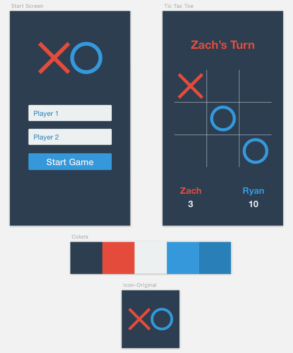

# Tic Tac Toe

An experiment with functional reactive programming in Swift.

## Technologies Used
* Swift 2.1.*
* [ReactiveCocoa](https://github.com/ReactiveCocoa/ReactiveCocoa)
* [Sketch](https://www.sketchapp.com/)

## Installation

You'll need [Carthage](https://github.com/Carthage/Carthage) to install ReactiveCocoa and its dependencies.

`carthage update`

`open TicTacToe.xcodeproj` 

## The Goods
